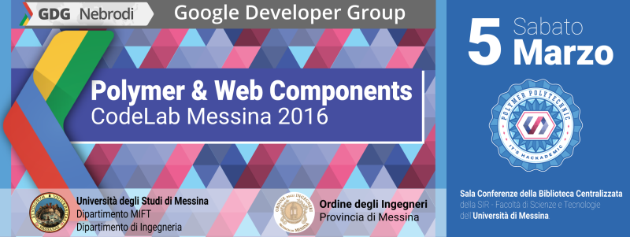

# Polymer Codelab Messina

A minimal app based on [Polymer Starter Kit Light](https://developers.google.com/web/tools/polymer-starter-kit/)!

## Firing up a server using Python

Fire up a local server from inside the `app` directory.

If you are a Windows user, install Python and from inside the `app` directory run:

```
python -m http.server 8080
```

or on a Mac/*nix machine, run:

```
python -m SimpleHTTPServer 8080
```

You can of course also use WAMP or an alternative tool for serving up content.
